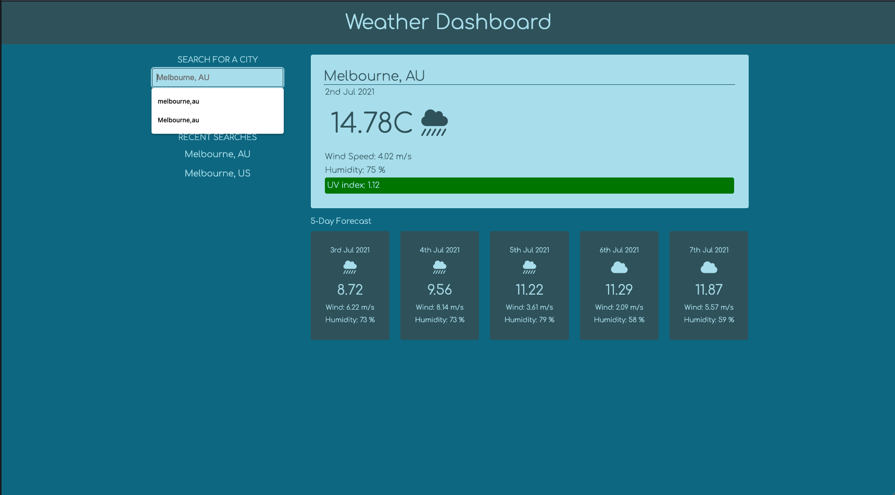

# 06-Weather-dashboard

 

<h2 style="text-align:center" id="table-of-content"> Table of Contents </h2>

- [Purpose](#purpose)
- [Features](#features)
- [Preview](#preview)
- [Usage](#usage)
- [Installation](#installation)
- [Credits](#credits)
- [License](#license)

## <h2 style="text-align:center" id="purpose">Propose</h2>
[(Back to top)](#table-of-content)

In this project, I was tasked to write a weather dashboard as a way to practice making server side API requests. The weather data for cities is accessible through [OpenWeather One Call API](https://openweathermap.org/api/one-call-api). 

## <h2 style="text-align:center" id="features">Features</h2>
[(Back to top)](#table-of-content)

The final products should have the following features:
- When the page is load initially, the user is presented with form inputs. 
- When the user correctly enters a city name, the current weather and a 5-day forecast for that city should appear
- They should have 
  - the city name, 
  - the date, 
  - an icon representation of weather condition,
  - the wind speed,
  - the temperature, and
  - the UV index, which is colour coded to indicate the severity.
- A search is saved each time and weather data can retrieved when they click on it. 

## <h2 style="text-align:center" id="preview">Preview</h2>
[(Back to top)](#table-of-content)

The end product should resemble the mock-up provided below:

> **Note:** This layout will not look as good when the resolution drops below 300px.

## <h2 style="text-align:center" id="usage">Usage</h2> 
[(Back to top)](#table-of-content)

The final webpage can be accessed through the following [link](https://supasiti.github.io/06-weather-dashboard/).

## <h2 style="text-align:center" id="installation">Installation</h2> 
[(Back to top)](#table-of-content)

To use this project, first clone the repo on your device using the commands below:

    git init
    git clone https://github.com/Supasiti/06-weather-dashboard.git

## <h2 style="text-align:center" id="credits"> Credits</h2>
[(Back to top)](#table-of-content)

Monash University Full Stack Boot Camp on behalf of Trilogy Education - 2021 (Provided Assets)

## <h2 style="text-align:center">License</h2>
[(Back to top)](#table-of-content)

[GNU GPLv3](https://choosealicense.com/licenses/gpl-3.0/)
